# Backend Flows — Plain-English Guide

Every flow the HigherPays backend runs, drawn as a picture and described
without jargon. The diagrams are [mermaid](https://mermaid.js.org/) so they
render live inside GitHub, Cursor, and VS Code — no image files to keep in
sync with the code.

**Read this in order.** The first section explains the pieces; every later
section reuses the same actors.

---

## Contents

1. [The parts of the system](#1-the-parts-of-the-system)
2. [How agencies are kept private from each other](#2-how-agencies-are-kept-private-from-each-other)
3. [A brand-new agency signs up](#3-a-brand-new-agency-signs-up)
4. [Someone signs in](#4-someone-signs-in)
5. [Renewing an expired session](#5-renewing-an-expired-session)
6. [Creating a payment link](#6-creating-a-payment-link)
7. [A payment arrives (the webhook — the most important flow)](#7-a-payment-arrives-the-webhook)
8. [The reconciler — safety net when a webhook is missed](#8-the-reconciler)
9. [Recording a refund](#9-recording-a-refund)
10. [Paying out commissions](#10-paying-out-commissions)
11. [Importing a settlement file](#11-importing-a-settlement-file)
12. [Notifications (in-app + Telegram)](#12-notifications)
13. [The HigherPays super-admin](#13-the-higherpays-super-admin)

---

## 1. The parts of the system

Six actors are enough to describe everything the backend does.

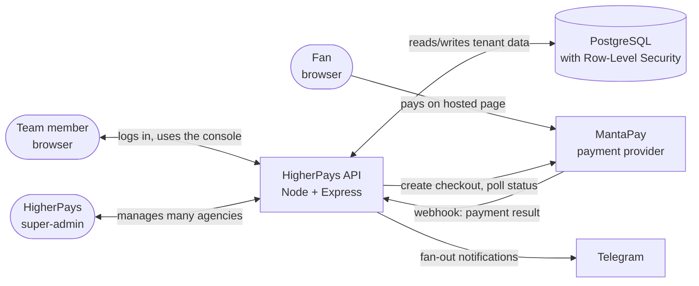

- **Team member** — agent, manager, admin, or owner of a specific agency.
- **Fan** — the customer who actually pays. Only ever talks to MantaPay's
  hosted page. Card details never touch our server.
- **API** — this backend. Every read and write from a browser passes through
  it; MantaPay pushes payment results to it.
- **PostgreSQL** — the database. Row-Level Security (RLS) is switched on, so
  the database itself refuses to return one agency's rows to another.
- **MantaPay** — the payment provider. Owns the checkout page, the card
  processing, and the settlement file.
- **Telegram** — used to ping the team's chat when a payment lands or fails.
- **HigherPays super-admin** — us. Sits above every agency and can adjust
  platform-fee rates, provision workspaces, etc.

Reading tip: every downstream flow re-uses these names.

---

## 2. How agencies are kept private from each other

Every table that belongs to a tenant has an RLS policy that boils down to:

> **You can only see rows where `workspace_id` matches the workspace attached
> to your session.**

The backend attaches that "attached workspace" for every request, and the
database uses it to filter automatically.

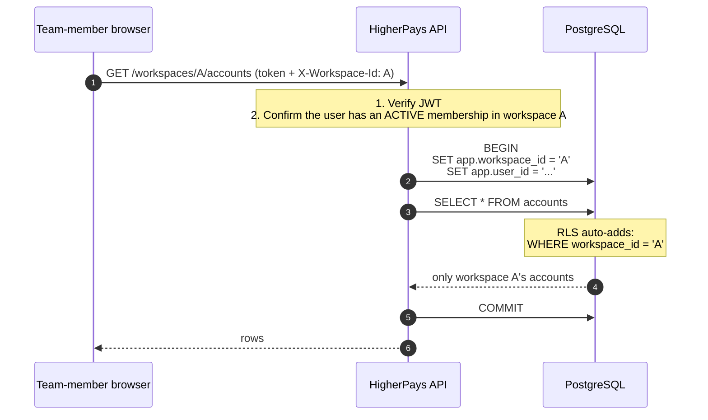

**What to know if it breaks:** the entire tenant boundary depends on the
database role NOT being a superuser and NOT having `BYPASSRLS`. The server
refuses to start in production if that isn't true. Never point the app at the
`postgres` maintenance role.

---

## 3. A brand-new agency signs up

`POST /auth/register` provisions the whole tenant in one transaction:
organization → workspace → owner user → owner membership → default roles.
The first user of an agency is always its owner.

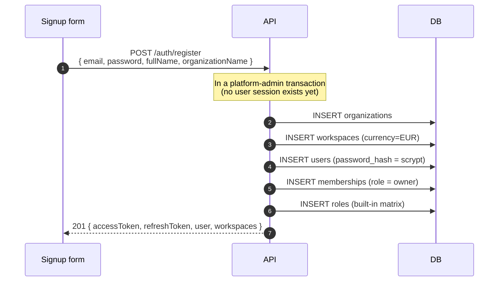

- The password is hashed with **scrypt** — slow to brute-force by design.
- The refresh token is 48 bytes of randomness; the database only ever sees
  its SHA-256 hash.

---

## 4. Someone signs in

Password → optional 2FA → tokens. If 2FA is enabled, no token is issued until
the 6-digit code checks out.

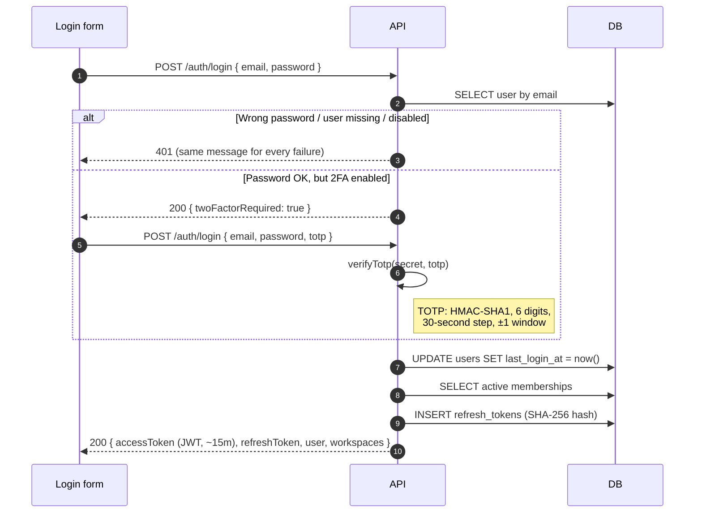

- The 401 message is deliberately the same whether the user exists or the
  password is wrong: no user-enumeration by trying emails.
- `last_login_at` is updated on every successful login.

---

## 5. Renewing an expired session

Access tokens live for ~15 minutes. When one expires, the browser trades
its refresh token for a fresh access token. The refresh token is **rotated**
at the same time — the old one is revoked, and the browser must remember the
new one.

```mermaid
sequenceDiagram
  autonumber
  participant B as Browser
  participant API
  participant DB

  B->>API: POST /auth/refresh { refreshToken }
  API->>DB: SELECT refresh_tokens WHERE token_hash = sha256($1)
  alt Missing / revoked / expired
    API-->>B: 401
  else Valid
    API->>DB: UPDATE refresh_tokens SET revoked_at = now()  (revoke old)
    API->>DB: INSERT refresh_tokens (new random 48B; store its sha256)
    API-->>B: 200 { accessToken, refreshToken (new) }
  end
```

If a refresh token is ever leaked, the attacker can only use it once —
using it revokes it. The real user's next refresh attempt will 401 and force
them to log back in, which is the alarm signal.

---

## 6. Creating a payment link

An agent (or manager/owner) creates a link a fan will pay on. The backend
signs a MantaPay hosted-page URL and returns it. No fee is charged and no
transaction is created yet — that only happens when the fan actually pays.

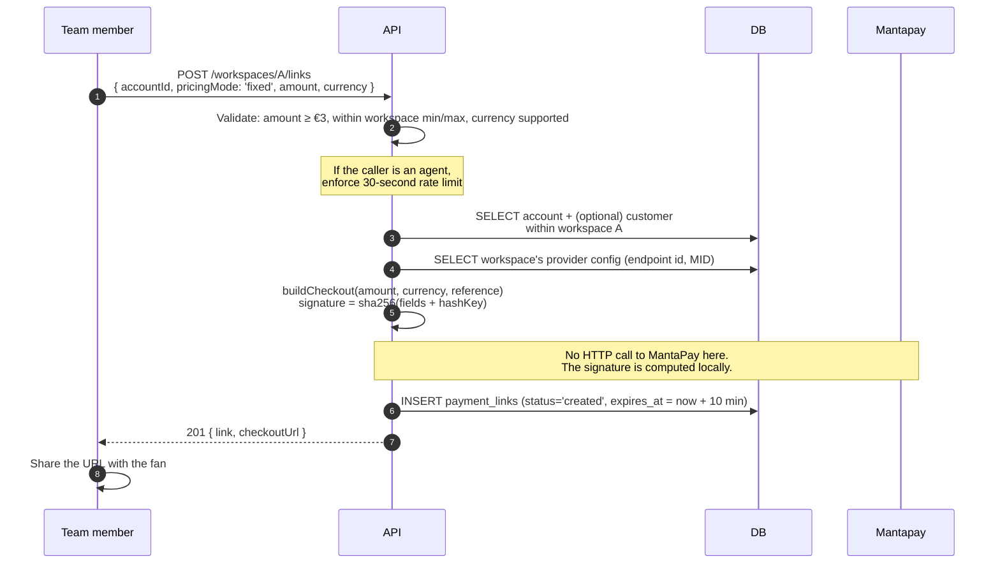

- The reference id is a short random string (`ord_...`) and is the only ID
  MantaPay knows the link by. It's what shows up in every later webhook.
- MantaPay bakes the amount into the signed URL, so `pricingMode: 'open'`
  isn't supported today — the API rejects it with a clear message.
- `expires_at` is baked in for both sides: MantaPay uses it as `ExpiredOn`,
  the reconciler uses it to decide when to give up on a link.

---

## 7. A payment arrives (the webhook)

This is the most important single flow in the whole product. When the fan
finishes paying (or fails), MantaPay POSTs a form-encoded payload to a
per-workspace endpoint. The backend has to:

1. Figure out which agency it belongs to (before RLS knows).
2. Verify the payload is really from MantaPay.
3. Record the transaction in the ledger.
4. Flip the payment link's status.
5. Trigger the commission calculation.
6. Notify the team.

Every one of those steps has to be **idempotent** — MantaPay may retry the
same event, and we must not double-post.

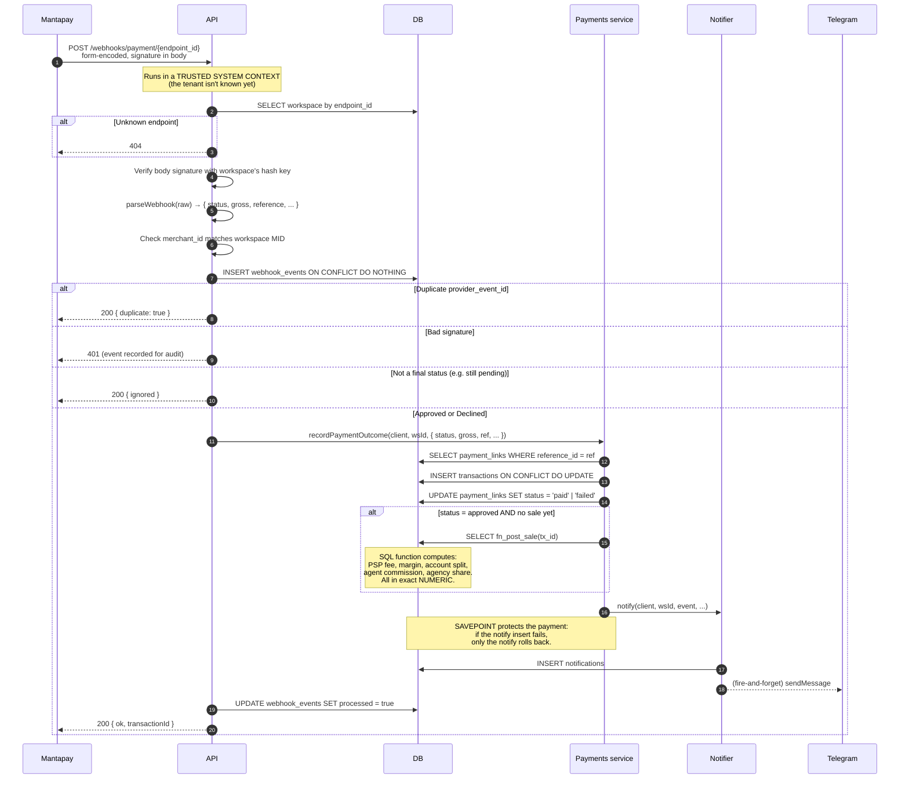

**Why it survives failures:**

- **Duplicate events:** the `webhook_events` table has a unique constraint on
  `(provider, provider_event_id)`. The second delivery hits `ON CONFLICT DO
  NOTHING` and returns 200 without touching the ledger.
- **Bad signatures:** recorded (`signature_valid=false`) for audit, then
  refused with 401. Never processed.
- **Notification blows up:** the SAVEPOINT limits the damage. The payment
  transaction still commits.
- **Fee not returned by MantaPay:** the ledger stores the transaction with
  `fee=0` and the payout engine prices the sale from the workspace's rate
  card. The Search API reconciliation later replaces the estimate with the
  actual figure.

---

## 8. The reconciler

Not every webhook actually arrives. Networks fail, MantaPay's queue backs up,
a container restarts at the wrong second. The reconciler is the safety net.

An operator (or a cron job) hits `POST /workspaces/A/links/reconcile`. The
backend finds every link stuck in `created`/`opened` and older than the grace
window (0 minutes from the Links page, 10 by default), asks
MantaPay what actually happened, and applies the outcome through the **same
Payments service the webhook uses**. Idempotent by construction: if the
webhook did land after all, `INSERT ON CONFLICT DO UPDATE` and
"has this sale already been posted?" quietly no-op.

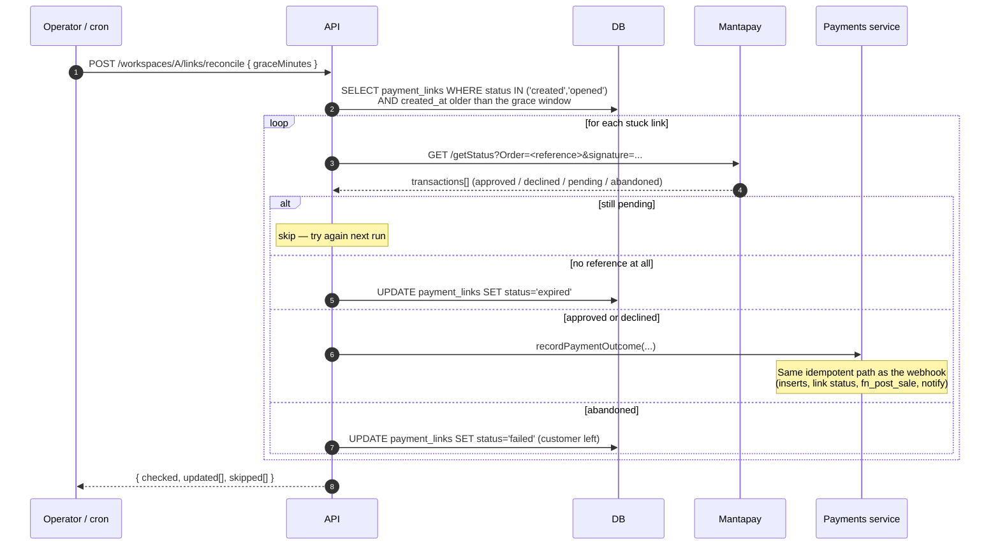

**Recommended cadence:** every few minutes. The endpoint requires the
`commissions.manage` permission.

---

## 9. Recording a refund

MantaPay's refund API is a two-step admin-approved flow that we haven't
built the adapter for yet. Until we do, refunds are **issued in MantaPay's
dashboard** and the console just records the reversal in the ledger.

The refund flow is idempotent: a second call for the same transaction is
rejected with `already_reversed`.

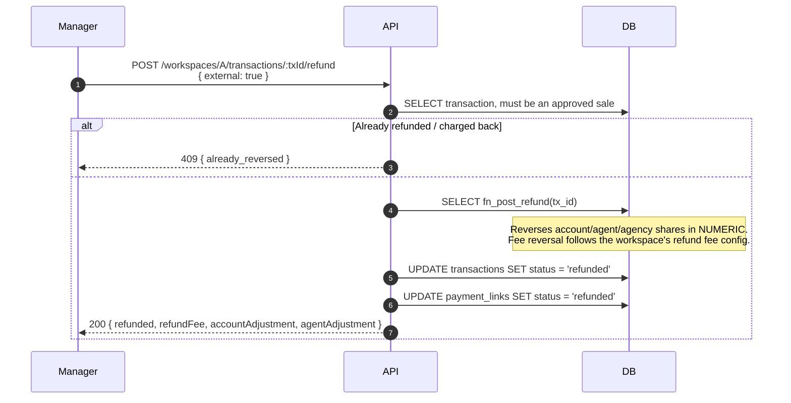

When we build the MantaPay refund adapter, `external: false` will call it
before the ledger reversal and abort if MantaPay refuses.

---

## 10. Paying out commissions

Individual sales accumulate into `commission_entries` (one row per party per
transaction). A payout run picks a period, groups unpaid entries by payee,
and marks them paid.

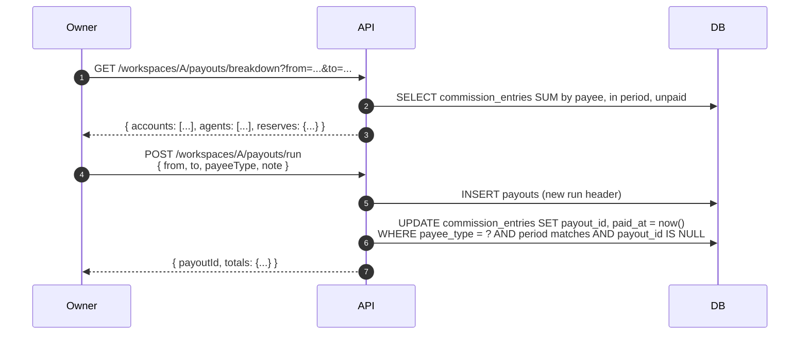

- The **amounts are already computed** — `fn_post_sale` did it at the moment
  the transaction was recorded. A payout run doesn't recompute anything; it
  just flips the "paid" flag on the ledger.
- Rolling reserves are computed on the fly at the breakdown endpoint from
  `settlement_fee_config` + the `settlements` table.

---

## 11. Importing a settlement file

MantaPay sends a periodic XLSX settlement file. Uploading it against a
workspace snapshots the provider's own view of gross/fees/net into the
`settlements` table so we can reconcile with our ledger and release reserves.

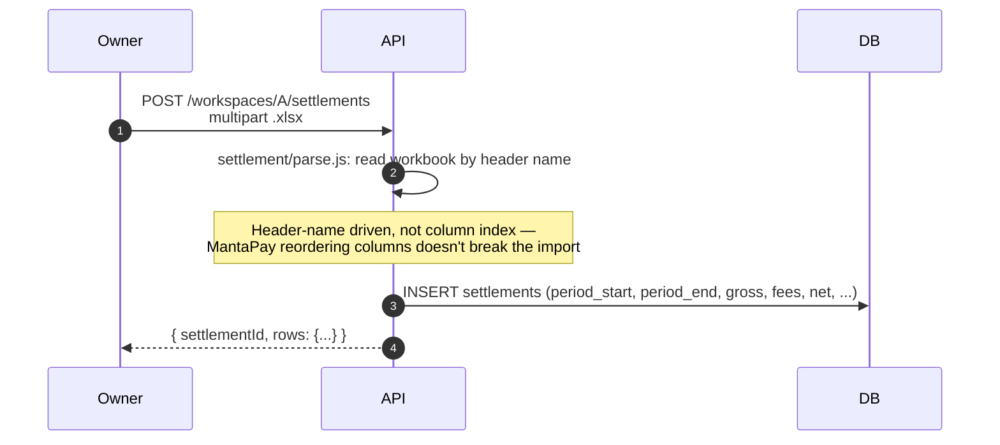

The parser is deliberately tolerant of small format wobbles (blank rows,
extra header rows). Anything actually unparseable throws with the raw
context so a human can fix it.

---

## 12. Notifications

Every business event that matters produces two things:

- an in-app **feed row** (`notifications` table), which the console reads;
- an optional **Telegram message** to the workspace's configured chat.

The notification system is deliberately best-effort: notifications never
block a business operation. Failures are logged and swallowed at the
SAVEPOINT boundary (see webhook flow §7).

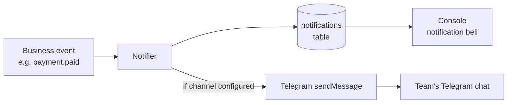

Preferences per user (`notification_preferences`) and channels per workspace
(`notification_channels`) decide whether a given event fans out. The
`TELEGRAM_BOT_TOKEN` is a HigherPays-owned secret, so workspaces store only
a `chat_id`, never a token.

---

## 13. The HigherPays super-admin

The people running HigherPays (us) sit above every agency. Membership in
`platform_admins` grants access to `/platform/*` routes AND grants an
implicit "operator" membership on every workspace, so the same person can
diagnose a specific agency without being individually invited.

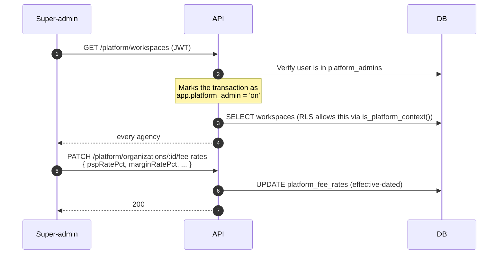

RLS treats "platform context" as a controlled bypass — it's turned on
explicitly by middleware after checking the `platform_admins` table, and
turned off automatically at the end of the transaction. There is no way for
a workspace user to opt themselves into this context.

---

## Where each flow lives in the code

| Flow | Route file | Service / SQL doing the work |
|---|---|---|
| Register / login / 2FA / refresh | `src/routes/auth.routes.js` | `src/auth/*` |
| Tenant isolation | every route via | `src/db.js` (`withWorkspace`) + migrations 002/006/025 |
| Create link | `src/routes/links.routes.js` | `src/providers/mantapay-checkout.js` |
| Webhook | `src/routes/webhooks.routes.js` | `src/services/payments.service.js` (+ `fn_post_sale` in SQL) |
| Reconcile | `src/routes/links.routes.js` (`/reconcile`) | same payments service |
| Refund | `src/routes/payouts.routes.js` (`/transactions/:id/refund`) | `fn_post_refund` in SQL |
| Payout run | `src/routes/payouts.routes.js` (`/payouts/run`) | inline JS, no computation |
| Settlement | `src/routes/settlements.routes.js` | `src/settlement/parse.js` |
| Notify | anywhere, called via | `src/notify.js` |
| Super-admin | `src/routes/platform.routes.js` | RLS `is_platform_context()` |

Every one of these has an integration test covering the happy path (see
`backend/test/integration/`).
